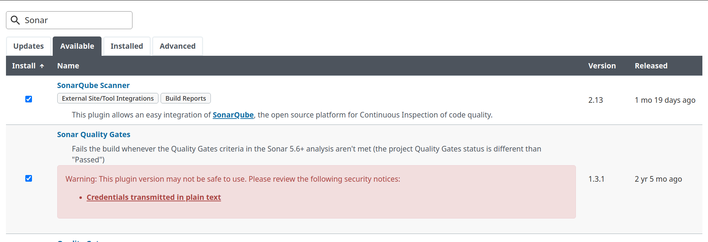
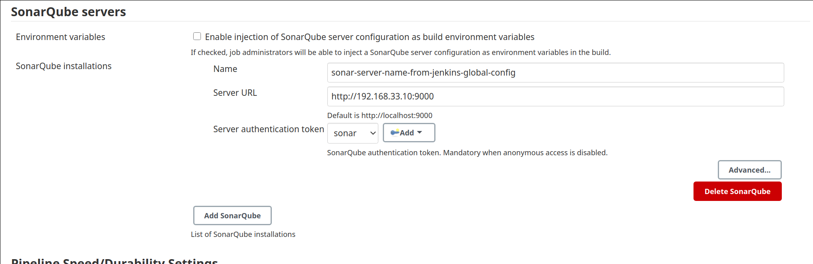
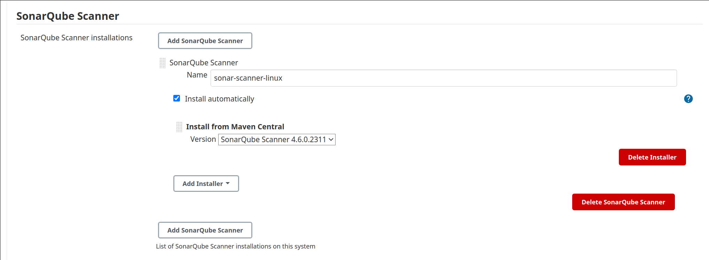

# Node One Page

Steps to configure Jenkins SonarQube integration:\
(Official documentation  [https://docs.sonarqube.org/latest/analysis/scan/sonarscanner-for-jenkins/](https://docs.sonarqube.org/latest/analysis/scan/sonarscanner-for-jenkins/):
1. Install SonarScanner Jenkins plugin (and SonarQube gates if needed):

2. Generate Sonar Server authorization token (under Sonar Admininstration panel) and add it to Jenkins credentials\
3. Configure Sonar Server in Jenkins Global Configuration:

4. Configure Sonar Scanner in Global Tool Configuration:

